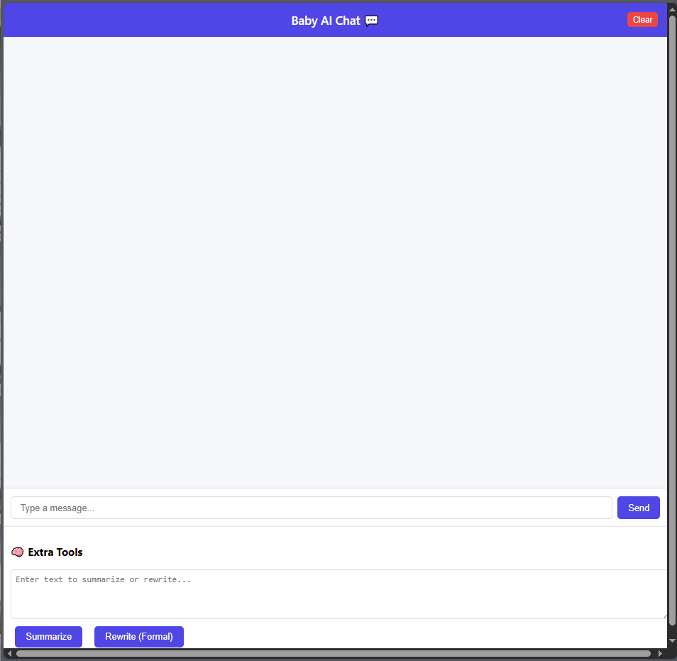

# 💬 Baby AI — Groq-Powered Conversational Web App

### 🚀 Overview
**Baby AI** is a lightweight conversational AI web application powered by **Groq LLMs** and built using **FastAPI** and **vanilla JavaScript**.  
It demonstrates full-stack AI integration — from backend API design to frontend interactivity — showcasing real-world skills for AI Developer or Copilot Engineer roles.

---

### 🧠 What’s Inside
- 💬 **Conversational Chat** — context-aware responses powered by Groq’s `llama-3.3-70b-versatile`
- 🧾 **Summarization Tool** — generate short, bullet, or detailed summaries
- ✍️ **Rewrite Assistant** — rewrite any text in various tones (formal, casual, friendly)
- 🧩 **Memory & Reset** — maintains session-based chat memory
- 🎨 **Web Interface** — built with pure HTML, CSS, and vanilla JS (no frameworks)

---

### ⚙️ Tech Stack
| Layer | Technology |
|--------|-------------|
| **Language Model** | [Groq API](https://groq.com/) — high-speed inference for open LLMs |
| **Backend** | Python 3.13 + FastAPI |
| **Frontend** | HTML + CSS + JavaScript (Vanilla JS) |
| **Data Handling** | Pydantic models + in-memory session storage |
| **Version Control** | Git + GitHub |

---

### 🧩 What is an LLM?
A **Large Language Model (LLM)** is an AI model trained on massive text datasets to understand and generate human-like language.  
LLMs are the core of AI copilots — they read, reason, and reply intelligently.  
Baby AI uses **Groq-hosted LLMs**, offering ultra-low latency, real-time responses, and fast inference for production-scale AI apps.

---

### 🌟 Screenshots

#### 💬 Chat Interface

#### 🧠 Summarization & Rewrite Tools

#### ⚙️ FastAPI Interactive Docs

> Powered by Groq LLMs, built from scratch with FastAPI + Vanilla JavaScript.

---

### 🧰 How to Run Locally

# clone the repo
git clone https://github.com/DeadBundy/baby-ai.git
cd baby-ai

# create and activate a virtual environment
python -m venv .venv
.\.venv\Scripts\activate  # on Windows

# install dependencies
pip install -r requirements.txt

# run the backend
python -m uvicorn server:app --reload --host 127.0.0.1 --port 8001

#Then open your browser:
👉 http://127.0.0.1:8001/chat-ui

This project demonstrates:
⚙️ Integration of real-world LLM APIs (Groq)
🧩 Backend design with FastAPI + Pydantic
🌐 Frontend built with vanilla JavaScript (no libraries)
🧠 Context memory and session handling
💬 Smooth human-like interaction loop

It mirrors how modern AI copilots work:
→ take user input → process with LLM → return a refined, contextual reply.

🧑‍💻 Author
Meghana S
AI & Software Enthusiast | Building Intelligent Systems with Purpose 
Built with 💜 using Python, Groq, and FastAPI.
